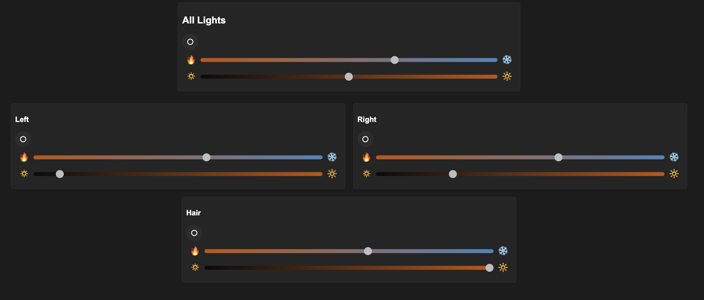
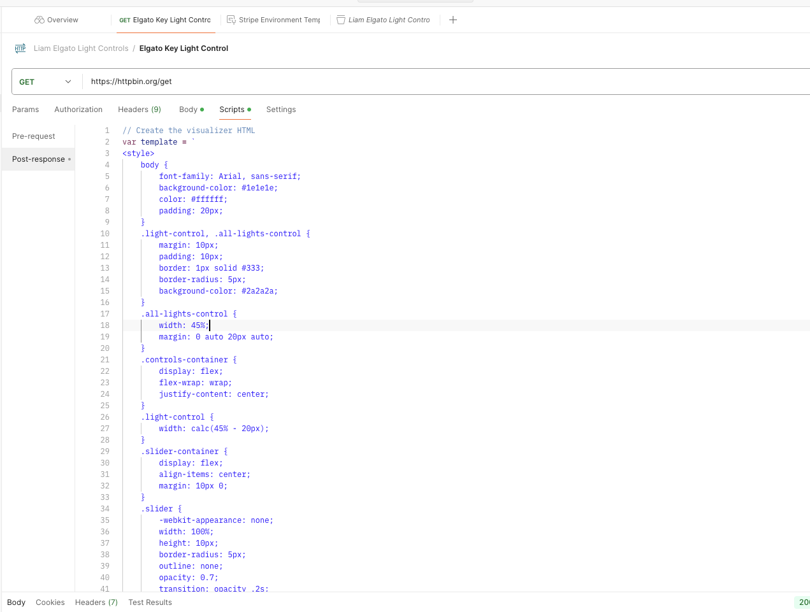
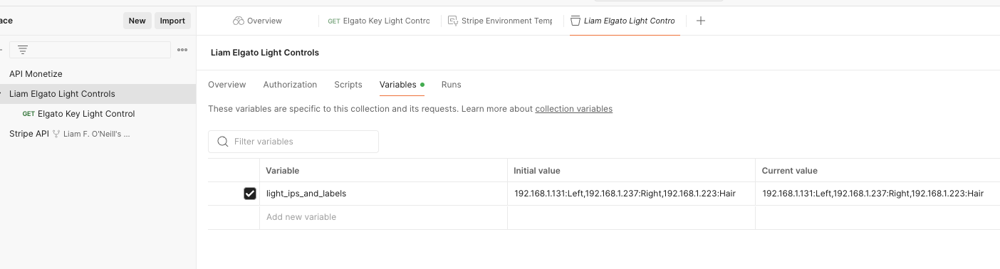
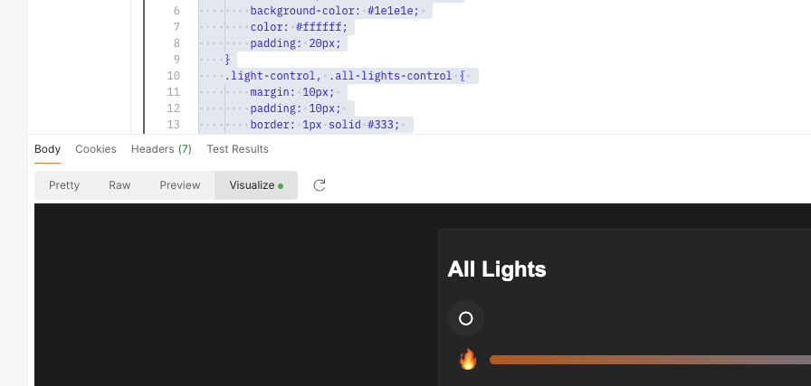

# Why does this exist?

Let's imagine that for whatever reason, you weren't allowed to use the Elgato Control Center application to control your expensive light but still wanted a visual way to control them. One of the 'approved' apps on your Machine is Postman. Well, this is a recreation of Elgato Control Center inside of Postman.

## How to Use This

1. Make Sure you have Postman installed.
1. Create a new 'dummy' API. Call it whatever you like and have it pointed at a reliable well-known URL. In my example I created a Get Request to 'https://httpbin.org/get'

1. Under 'Scripts' and inside the 'Post-response' area copy the contents of script.js from inside this repo and paste it into the 'Post-reponse' area'.
1. The script expect an environment varible setup in Postman that contains the IP addresses and names for your lights. In my example the environment variable I have is named 'light_ips_and_labels' and the value of '192.168.1.131:Left,192.168.1.237:Right,192.168.1.223:Hair'. You can include as many light here as you like, the UI will be dynamic to show them. Make sure you set static IPs for your lights in your router for this to be reliable.

1. Hit send on your API. You should get a 200 response and inside the 'Visualize' pane you should now see your light controls. You have the option of controlling the lights individually or all together, just like in the official app!
